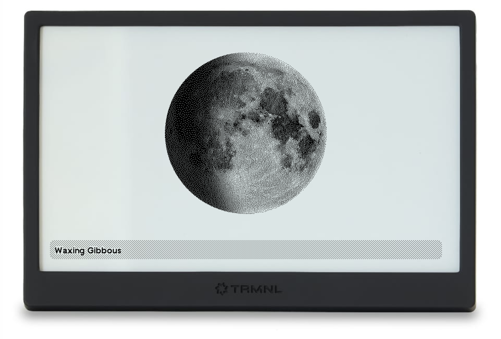

# Moonphase plugin for TRMNL

This [TRMNL](https://usetrmnl.com/) plugin displays the current phase of the moon.

It's a private plugin with no data source required for polling. It relies on a couple external sources for the moon image and JS calculations.

## Templates

- [Full](views/full.liquid)
- [Half horizontal](views/half_horizontal.liquid)
- [Half vertical](views/half_vertical.liquid)
- [Quadrant](views/quadrant.liquid)
